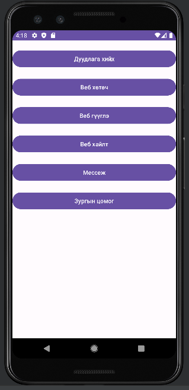

ImplicitIntentDemo - Implicit Intent Demo
Overview
This project, named ImplicitIntentDemo, is an Android application demonstrating the use of Implicit Intents. Implicit Intents allow the app to request actions (e.g., opening a URL, sharing text) and let the Android system choose the appropriate app to handle the request.

Project Name: ImplicitIntentDemo
Application Name: ImplicitIntentDemo
Build Target: Android 4.0.3 (API 15)
Features: Implicit Intent for web browsing, sharing content, and basic navigation

Prerequisites

Android Studio: Installed on your development machine
Android SDK: API 15 (Ice Cream Sandwich) or higher
Git: Optional, for version control
Device/Emulator: API 15+ for testing

Setup Instructions
Clone or Open the Project

If using Git, clone the repository:git clone <repository-url>

Open in Android Studio: File > Open > Select D:\hicheel\MobileProgramming\lab\AndroidStudioProjects\ImplicitIntentDemo

Build the Project

Sync Gradle: File > Sync Project with Gradle Files
Build the app: Build > Rebuild Project

Run the App

Connect an Android device or use an emulator (API 15+)
Click Run in Android Studio

Project Structure
Java Files

MainActivity.java: Contains the Implicit Intent implementation (e.g., opening a webpage or sharing text)
Other files (if present): May include additional activities or utilities

Layout Files (app/src/main/res/layout/)

activity_main.xml: Main screen UI with buttons or inputs to trigger Implicit Intents

Build File

app/build.gradle.kts: Defines project dependencies

Usage
Implicit Intent Examples

Open Webpage: Click a button to open a URL (e.g., "https://www.example.com") in the default browser
Share Text: Select text and use a share button to send it via email, messaging apps, etc
Result: The app displays a success message or launches the chosen app (e.g., Chrome, Gmail) based on the Intent

Sample Code (Example)
In MainActivity.java:
import android.content.Intent;
import android.net.Uri;
import android.os.Bundle;
import android.view.View;
import android.widget.Button;
import androidx.appcompat.app.AppCompatActivity;

public class MainActivity extends AppCompatActivity {
    @Override
    protected void onCreate(Bundle savedInstanceState) {
        super.onCreate(savedInstanceState);
        setContentView(R.layout.activity_main);

        Button openWeb = findViewById(R.id.open_web);
        openWeb.setOnClickListener(new View.OnClickListener() {
            @Override
            public void onClick(View v) {
                Intent intent = new Intent(Intent.ACTION_VIEW, Uri.parse("https://www.example.com"));
                startActivity(intent);
            }
        });

        Button shareText = findViewById(R.id.share_text);
        shareText.setOnClickListener(new View.OnClickListener() {
            @Override
            public void onClick(View v) {
                Intent intent = new Intent(Intent.ACTION_SEND);
                intent.setType("text/plain");
                intent.putExtra(Intent.EXTRA_TEXT, "Check out this app!");
                startActivity(Intent.createChooser(intent, "Share via"));
            }
        });
    }
}

Screenshots

Dependencies

AndroidX: For UI components

Notes

Target API: Uses Android 4.0.3 (API 15); consider updating to API 33 for modern compatibility
Intent Result: The app relies on system apps to handle Intents; ensure a browser or sharing app is installed
Git Ignore: Ensure .gitignore excludes local.properties, .idea/, .gradle/, and build/

Contributing

Fork the repository
Create a new branch for changes
Submit a pull request

License
For educational purposes only. No specific license unless specified by your instructor
Created On

October 24, 2025, 04:22 PM +08
